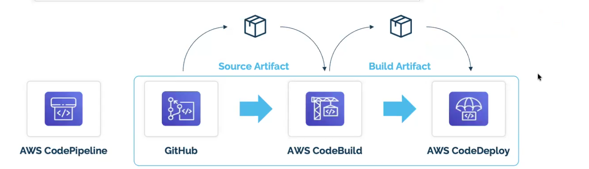
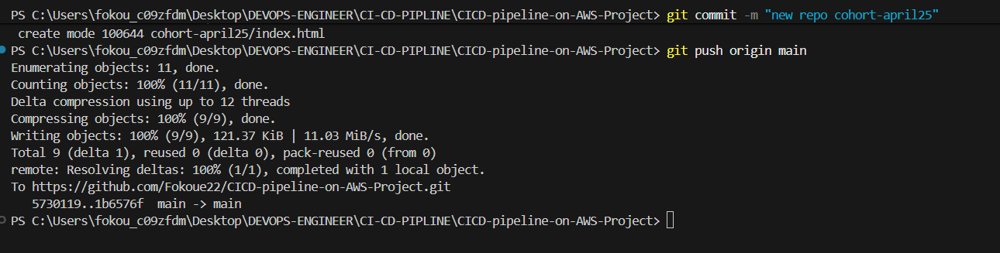
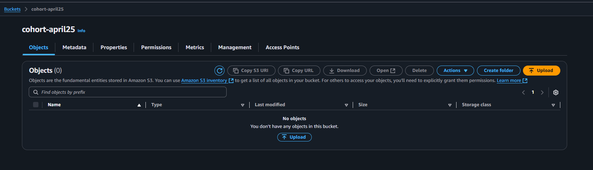
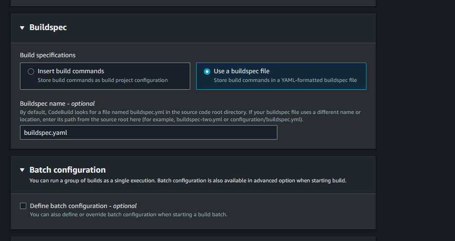

#  DevOps-on-AWS
This repository contain CI/CD pipeline using CODEPIPELINE build for devop-april25

# 3stage-Codepipline-with-bluidSstage
Setup a three stage CI/CD pipeline using CODEPIPELINE and CODEBUILD to automatically deploy a build.yaml file on AMAZON S3 Bucket. The file will install a python file that will contain our "HellWorld from CodeBuild!!!' is will display a simple HTML webpage. 

### The first step is to create and connect to your repo on git and push your html file e.g 3stage-Codepipline-with-bluidSstage

### Next step is to create a hosting S3 bucket and don't Block all public access
 

  
### We need to enable Static website hosting and add our index.html and error.html(this is optional)

### Now let open our CodePipeline and create our Pipelin. 
### - In category choose "Build custom pipeline", 
### - give Name, 
### - on source stage "choose Github and establish a connection with your repo (on default branch type 'main')",
### - On Build stage, click on "Other build providers" then choose "AWS CodeBuild" Now we ned to do the intergration between our Codepipline and Codebuild and for that we click on "create Project". From the a new page is going to come from bluidspace "give the name" and leave "all the reste default" on Buildspec click on "Use a buildspec file" and on builspec name -optional type "buildspec.yml" the create your BuildSpec 

### - Skip test stage,
### - Add 'Amazon S3" as your deploy stage and choose you s3 bucket, you have to select Extract file before deploy(very very important). Then allow every default
### - Then create pipeline  

### Check our S3 bucket 

Here, we see how codepipeline have successfully push our git repo contain to S3.

## Author
FOKOUE THOMAS
