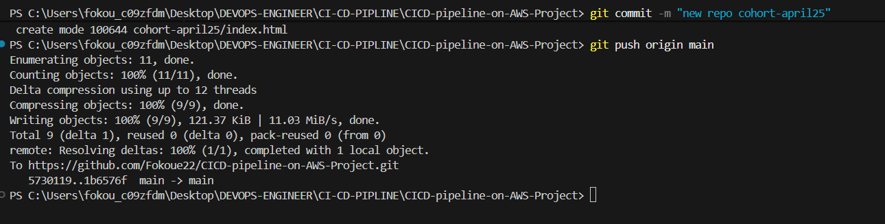
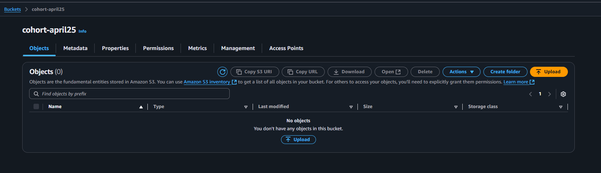
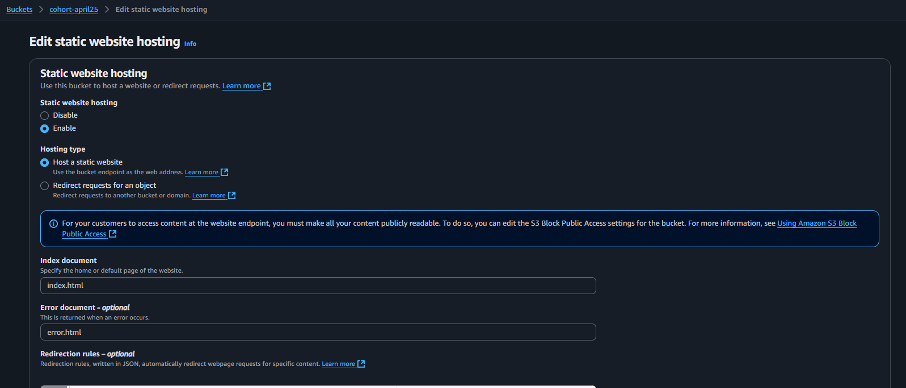
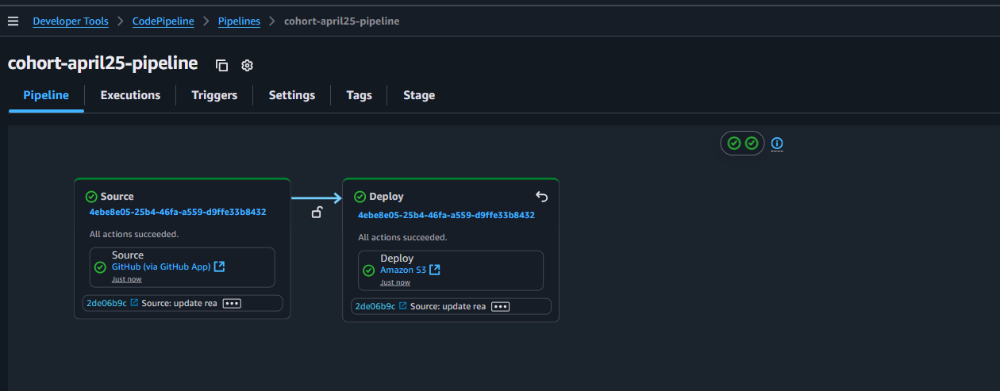
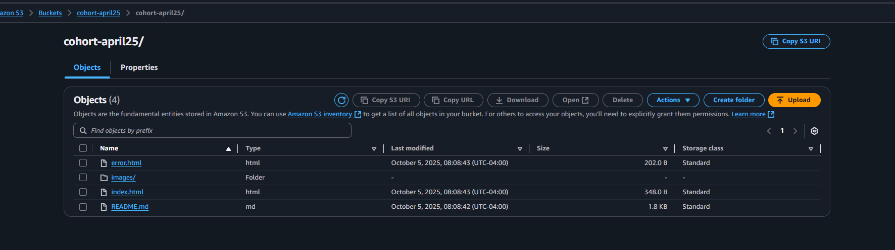
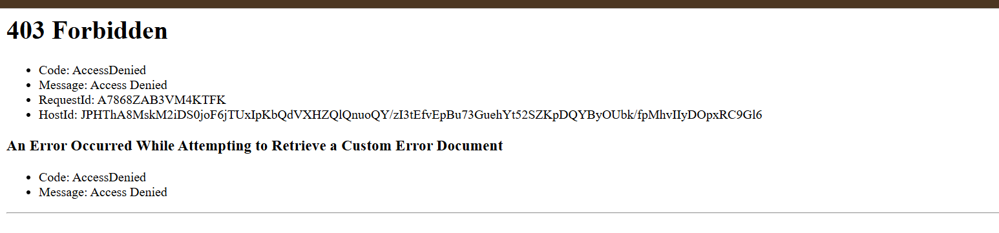
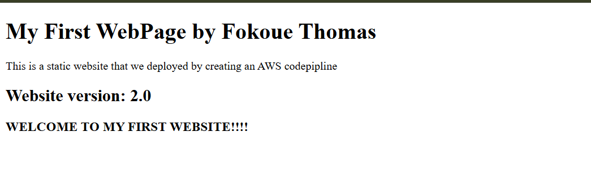

#  DevOps-on-AWS
This repository contain CI/CD pipeline using CODEPIPELINE build for devop-april25

# COHORT_APRIL25
Setup a two stage CI/CD pipeline using CODEPIPELINE to automatically deploy a static website on AMAZON S3 Bucket. The website is will display a simple HTML webpage. 


### The first step is to create and connect to your repo on git and push your html file e.g cohort-april25



### Next step is to create a hosting S3 bucket and don't Block all public access
 

  
### We need to enable Static website hosting and add our index.html and error.html(this is optional)



### Now let open our CodePipeline and create our Pipelin. 
### - In category choose "Build custom pipeline", 
### - give Name, 
### - on source stage "choose Github and establish a connection with your repo (on default branch type 'main')",
### - Skip build stage and test stage, 
### - Add 'Amazon S3" as your deploy stage and choose you s3 bucket, you have to select Extract file before deploy(very very important). Then allow every default
### - Then create pipeline  




### Check our S3 bucket 



Here, we see how codepipeline have successfully push our git repo contain to S3.

## Now let verifier the content of our index.html

### Open the local system, Create a new file called tasks.txt then Execute the below commands


Here, we can see that we'are deniet permission to see the contain of our index.html file. 

### To resolve that issue we need a bucket policy to solve that issue. So we copy th policy below and change that bucket name with our bucket name 
```
{
    "Version": "2012-10-17",
    "Statement": [
        {
            "Sid": "PublicReadGetObject",
            "Effect": "Allow",
            "Principal": "*",
            "Action": [
                "s3:GetObject"
            ],
            "Resource": [
                "arn:aws:s3:::YOUR_BUCKET_NAME/*"
            ]
        }
    ]
}

```


## Author
FOKOUE THOMAS
